<div align="center">


<br/>

[](https://python.org)
[](https://numpy.org)
[](https://jupyter.org)
[](LICENSE)

<br/>

## *Build it from scratch. Break it on purpose. Understand it completely.*

<br/>

</div>

---

## Table of Contents

| | Section |
|:---:|:---|
| 01 | [What This Actually Is](#what-this-actually-is) |
| 02 | [Five Things This Project Proves](#five-things-this-project-proves) |
| 03 | [Project Architecture](#project-architecture) |
| 04 | [The Mathematical Engine](#the-mathematical-engine) |
| 05 | [The 6 Datasets](#the-6-datasets--each-one-a-different-stress-test) |
| 06 | [Training Pipeline](#the-full-training-pipeline) |
| 07 | [4 Optimizers](#4-optimizers--all-from-scratch) |
| 08 | [Regularization](#regularization--l1-l2-elastic-net) |
| 09 | [Statistical Inference](#statistical-inference--every-coefficient-gets-a-trial) |
| 10 | [Failure Mode Analysis](#failure-mode-analysis--the-part-most-projects-hide) |
| 11 | [Final Results](#final-results--all-6-datasets) |
| 12 | [Benchmark vs Sklearn](#benchmark--from-scratch-vs-sklearn) |
| 13 | [Quick Start](#quick-start) |
| 14 | [Project Stats](#project-stats) |
| 15 | [Roadmap](#roadmap) |

---

## What This Actually Is

Most ML courses teach you to call `sklearn.linear_model.LogisticRegression()` and move on. No derivation. No diagnostics. No honesty about failure.

This project does the opposite.

Every line of math — from the Bernoulli likelihood derivation to Wald z-tests to Newton-Raphson convergence — is implemented from first principles. The result is a complete **research-grade system** that trains, diagnoses, interprets, and **honestly evaluates itself** across 6 real-world datasets covering every major failure mode in binary classification.

| | This Project | Typical Tutorial |
|:---|:---|:---|
| **Implementation** | Pure NumPy, from scratch | `sklearn.fit()` |
| **Optimizers** | GD · SGD · Mini-Batch · Newton | One optimizer |
| **Regularization** | L1 · L2 · Elastic Net | Maybe L2 |
| **Statistical Inference** | p-values · CIs · odds ratios | None |
| **Failure Analysis** | ROC · PR · threshold tuning | Accuracy only |
| **Datasets** | 6 diverse real-world datasets | 1 clean dataset |
| **Honest Metrics** | MCC on all imbalanced data | Accuracy |
| **Theory** | 6 LaTeX derivation notebooks | None |

---

## Five Things This Project Proves

**1. Implementation forces understanding.**
You cannot implement Newton's method without knowing why the Hessian must be positive semi-definite. You cannot implement L1 without understanding the proximal gradient step. `sklearn.fit()` hides all of this behind one function call.

**2. Preprocessing wins models.**
Multicollinearity removal on Breast Cancer dropped condition number from ~10³ to 23.7. 80% of Phase VIII failure modes trace back to preprocessing decisions, not model architecture.

**3. Accuracy is a lie on imbalanced data.**
Credit Fraud: 99.78% accuracy, 0.06 MCC. Stroke: 95.11% accuracy, 0.00 MCC. Always use MCC. Always plot PR curves alongside ROC.

**4. Two data points can shift a decision boundary.**
Removing indices 81 and 557 from Heart Disease (2 out of 820 samples) measurably improves MCC. High-leverage analysis belongs in every training pipeline.

**5. Condition number predicts optimizer failure.**
Adult Income's 4.14×10¹⁶ condition number explains exactly why SGD collapses there. The math predicts the empirical result before you run a single experiment.

---

## Project Architecture

<p align="center">
  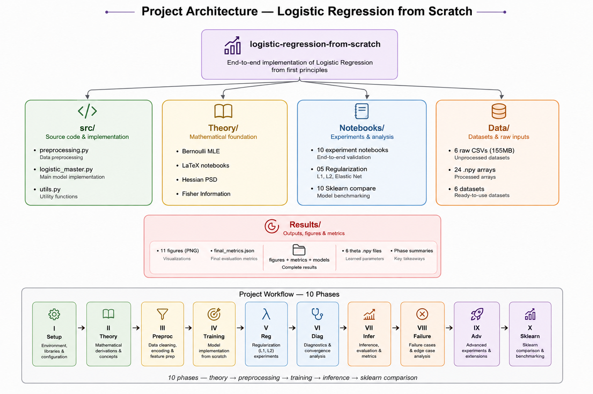
</p>

```
logistic-regression-research-engine/
│
├── src/
│   ├── logistic_master.py
│   ├── preprocessing.py
│   └── utils.py
│
├── Theory/
│   ├── 01_Bernoulli_MLE.ipynb
│   ├── 02_Logit_Link.ipynb
│   ├── 03_GLM_Proof.ipynb
│   ├── 04_Hessian_PSD.ipynb
│   ├── 05_Fisher_Information.ipynb
│   └── 06_Inference_Theory.ipynb
│
├── Notebooks/
├── Data/raw/
├── Data/processed/
├── Results/figures/
├── Results/models/
└── docs/
```

---

## The Mathematical Engine

<p align="center">
  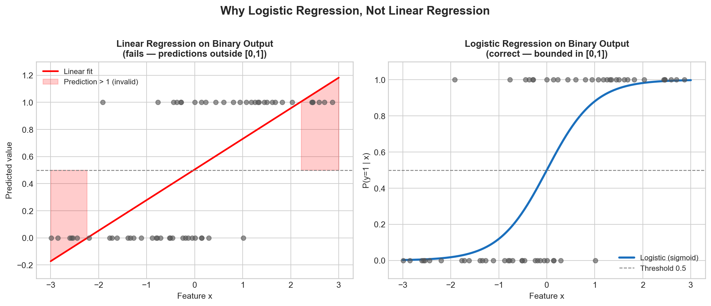
</p>

<p align="center"><i>Why linear regression fails at classification — and why the sigmoid is the correct solution.</i></p>

## The Sigmoid — Why This Shape, Not Another

<p align="center">
  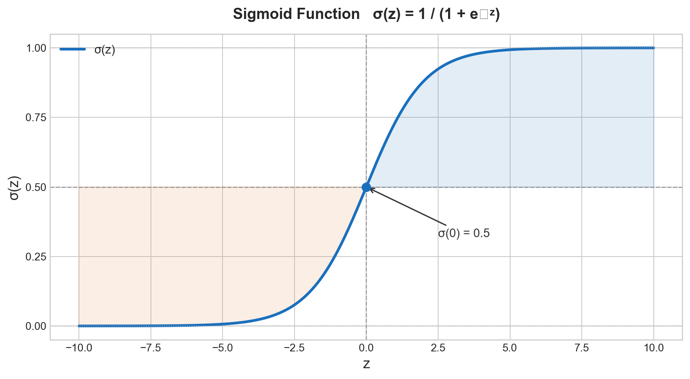
</p>

$$\sigma(z) = \frac{1}{1 + e^{-z}}$$

The sigmoid isn't chosen arbitrarily. It's the unique function that emerges from the Bernoulli log-likelihood when you solve for the probability that makes your data most likely. `02_Logit_Link.ipynb` proves this.

## Log-Loss — Derived, Not Assumed

$$J(\theta) = -\frac{1}{m} \sum_{i=1}^{m} \left[ y_i \log \hat{p}_i + (1 - y_i) \log(1 - \hat{p}_i) \right]$$

This is maximum likelihood estimation on Bernoulli random variables — not an arbitrary loss function. `01_Bernoulli_MLE.ipynb` derives every step.

## Gradient — Vectorized and Exact

$$\nabla J(\theta) = \frac{1}{m} X^T (\sigma(X\theta) - y)$$

## Hessian — Convexity Guaranteed

$$H = \frac{1}{m} X^T R X, \quad R = \text{diag}(p_i(1-p_i))$$

Because $R$ is diagonal with strictly positive values, $H$ is positive semi-definite — log-loss is **convex** and gradient descent will always find the global minimum. `04_Hessian_PSD.ipynb` proves this rigorously.

## Newton-Raphson — Second-Order Optimization

$$\theta := \theta - H^{-1} \nabla J(\theta)$$

| Notebook | What It Derives |
|:---|:---|
| `01_Bernoulli_MLE.ipynb` | Log-loss from Maximum Likelihood Estimation |
| `02_Logit_Link.ipynb` | Why logit is the canonical link function |
| `03_GLM_Proof.ipynb` | Logistic regression as a Generalized Linear Model |
| `04_Hessian_PSD.ipynb` | Positive semi-definiteness → convexity |
| `05_Fisher_Information.ipynb` | Fisher Information as foundation for inference |
| `06_Inference_Theory.ipynb` | Wald test → p-values → CIs → odds ratios |

---

## The 6 Datasets — Each One A Different Stress Test

<p align="center">
  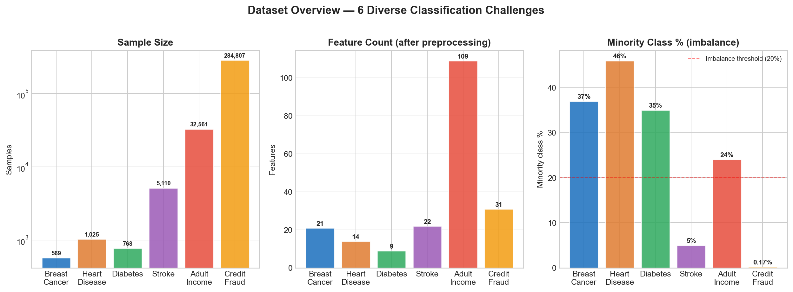
</p>

<p align="center"><i>Sample sizes span 3 orders of magnitude. Class imbalance spans balanced → 0.17% minority. Features span 9 → 109.</i></p>

| Dataset | N | Features | The Hard Part | Best MCC |
|:---|---:|---:|:---|:---:|
| 🔬 Breast Cancer | 569 | 21 | Multicollinearity | **0.9639** |
| 🩺 Diabetes | 768 | 9 | Hidden zeros + imbalance | **0.5302** |
| ❤️ Heart Disease | 1,025 | 14 | Small sample size | **0.7384** |
| 🧠 Stroke | 5,110 | 22 | Missing values + imbalance | **0.2722** |
| 💼 Adult Income | 32,561 | 109 | Scale + heavy encoding | **0.5701** |
| 💳 Credit Fraud | 284,807 | 31 | Extreme imbalance (0.17%) | **0.6815** |

> **Why MCC and not accuracy?** Credit Fraud: 99.78% accuracy — 0.06 MCC. Stroke: 95.11% accuracy — 0.00 MCC. MCC is the only metric that can't be gamed by predicting the majority class every time.

---

## The Full Training Pipeline

<p align="center">
  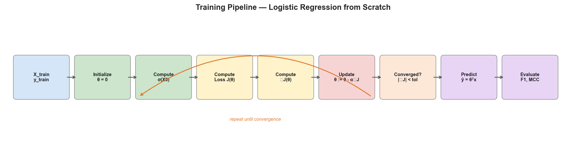
</p>

---

## Preprocessing Pipeline

<p align="center">
  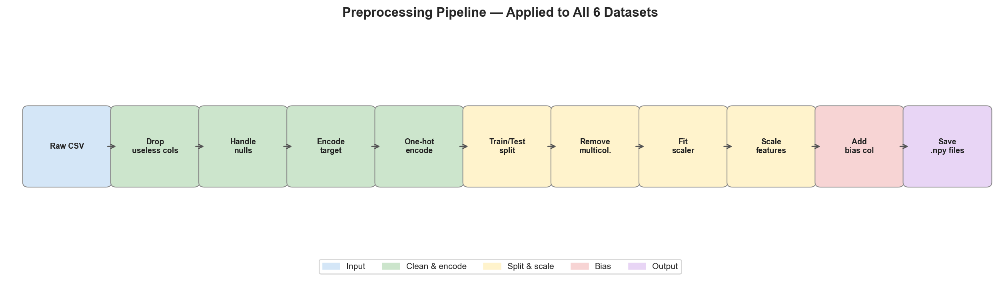
</p>

<p align="center"><i>12 preprocessing functions. Multicollinearity removal on Breast Cancer dropped condition number from ~10³ to 23.7.</i></p>

---

## 4 Optimizers — All From Scratch

```python
model = LogisticRegression()

# Gradient Descent — the baseline
model.fit_gd(X_train, y_train, alpha=0.1, epochs=1000)

# Stochastic Gradient Descent — one sample at a time
model.fit_sgd(X_train, y_train, alpha=0.1, epochs=100)

# Mini-Batch GD — best of both worlds
model.fit_mini_batch(X_train, y_train, alpha=0.1, epochs=100, batch_size=32)

# Newton-Raphson — second-order, uses curvature
model.fit_newton(X_train, y_train, max_iter=100, tol=1e-6)
```

## Loss Curves — All 4 Optimizers Head-to-Head

<p align="center">
  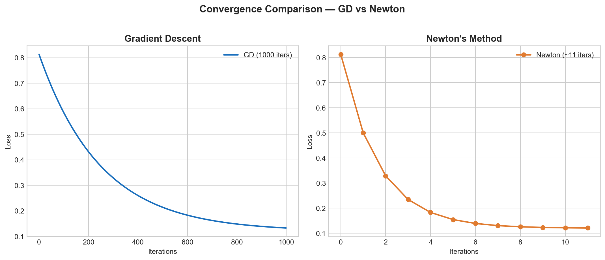
</p>

<p align="center"><i>GD, SGD, Mini-Batch, and Newton loss curves. The convergence gap is real and measurable.</i></p>

## 3D Cost Surface — What Gradient Descent Actually Navigates

<p align="center">
  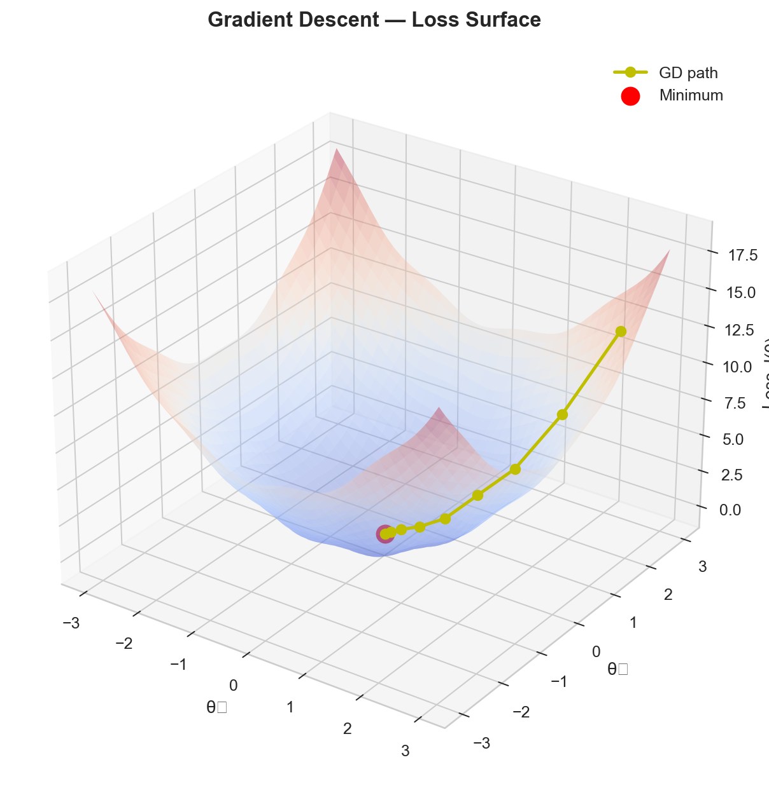
</p>

## Optimizer Benchmark — Across All 6 Datasets

<p align="center">
  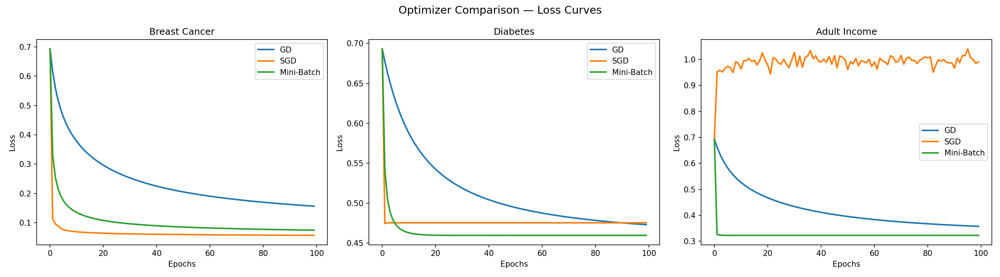
</p>

## Newton vs GD — The Convergence Numbers

| Dataset | GD Iterations | Newton Iterations | Speedup |
|:---|---:|---:|---:|
| Breast Cancer | 1,000 | **11** | **91×** |
| Diabetes | 1,000 | **~12** | **~83×** |
| Heart Disease | 1,000 | **~12** | **~83×** |

Newton doesn't just converge faster — it takes geometrically optimal steps using curvature. When you derive the Hessian yourself, you understand exactly why.

---

## Learning Rate Study

<p align="center">
  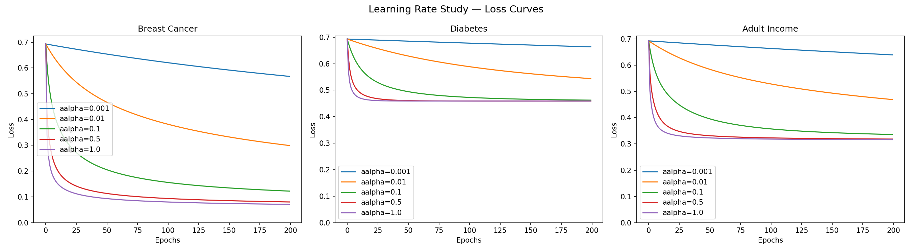
</p>

<p align="center"><i>Too small → glacial convergence. Too large → divergence. The condition number of each dataset predicts exactly which regime you land in.</i></p>

---

## Decision Boundary — What The Model Actually Learns

<p align="center">
  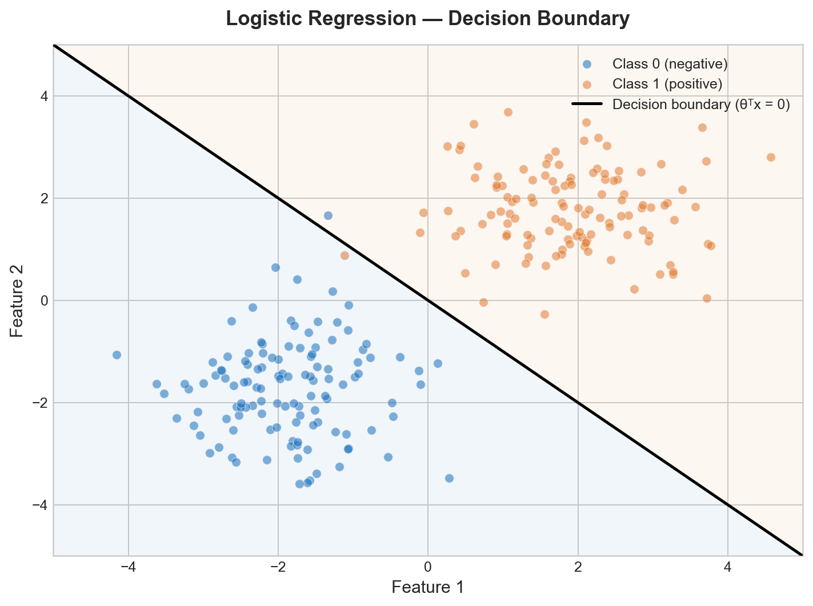
</p>

---

## Regularization — L1, L2, Elastic Net

## L1 Coefficient Path — Sparsity In Action

<p align="center">
  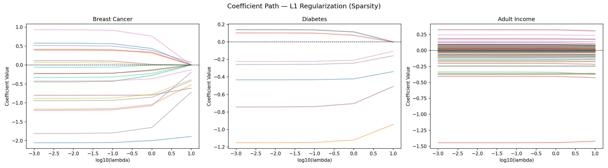
</p>

<p align="center"><i>Features dying to exactly zero as λ increases. This is L1 sparsity, live. Each line is a feature — the ones that flatline are eliminated.</i></p>

## L2 Coefficient Path — Smooth Shrinkage

<p align="center">
  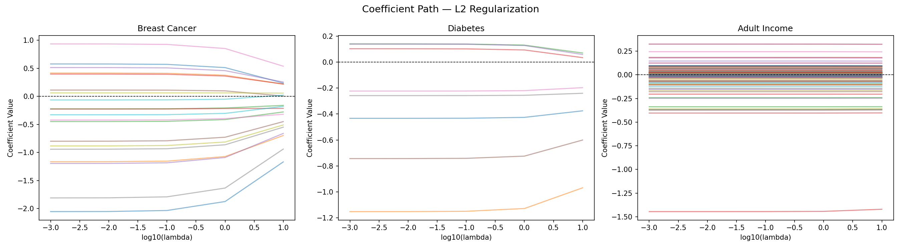
</p>

<p align="center"><i>L2 shrinks everything toward zero but never eliminates a feature entirely. Compare to L1 above — the difference is stark.</i></p>

```python
# L2 — smooth shrinkage, handles multicollinearity
model.fit_gd(X_train, y_train, lambda_reg=0.1, penalty='l2')

# L1 — kills irrelevant features via proximal gradient
model.fit_gd(X_train, y_train, lambda_reg=0.1, penalty='l1')

# Elastic Net — L1 sparsity + L2 stability
model.fit_gd(X_train, y_train, lambda_reg=0.1, penalty='elasticnet', l1_ratio=0.5)
```

---

## Statistical Inference — Every Coefficient Gets A Trial

```python
# Hessian → Covariance → Standard Errors → Z-scores → P-values → CIs
H        = model.compute_hessian(X, model.theta)
C        = np.linalg.pinv(H) / m
SE       = np.sqrt(np.diag(C))
Z        = model.theta.flatten() / SE
P        = 2 * (1 - stats.norm.cdf(np.abs(Z)))
CI_lower = model.theta.flatten() - 1.96 * SE
CI_upper = model.theta.flatten() + 1.96 * SE
OR       = np.exp(model.theta.flatten())
```

## Confidence Intervals — Per Feature, Per Dataset

<p align="center">
  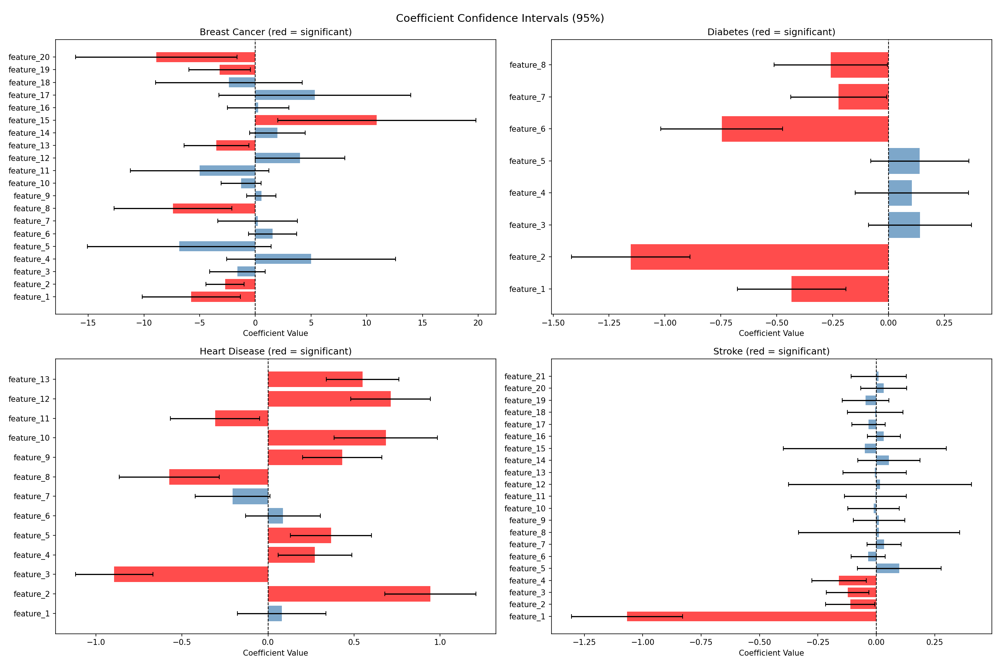
</p>

## Odds Ratios — Clinical Interpretability

<p align="center">
  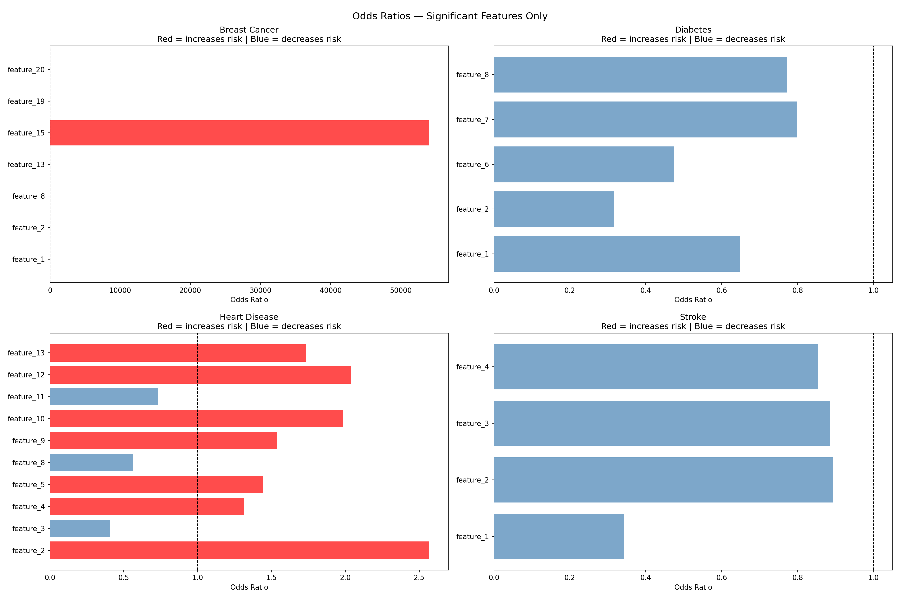
</p>

<p align="center"><i>Odds ratios with 95% CIs for Heart Disease. Features whose CI crosses 1.0 are not significant. Features far from 1.0 are the story.</i></p>

## Heart Disease — What The Numbers Actually Say

| Feature | Odds Ratio | Clinical Interpretation |
|:---|:---:|:---|
| `sex` | 2.57 | Being male **multiplies** heart disease odds by 2.57× |
| `num_vessels` | 2.04 | Each blocked vessel **doubles** the risk |
| `st_depression` | 1.98 | ST depression **nearly doubles** odds |
| `chest_pain` | 0.41 | Atypical angina **cuts** risk by 59% |
| `max_hr` | 0.56 | Higher max heart rate **protects** — 44% lower odds |

10 of 13 features statistically significant (p < 0.05). Clinical-grade interpretability from a 400-line NumPy implementation.

---

## Failure Mode Analysis — The Part Most Projects Hide

## ROC Curves — Across All 6 Datasets

<p align="center">
  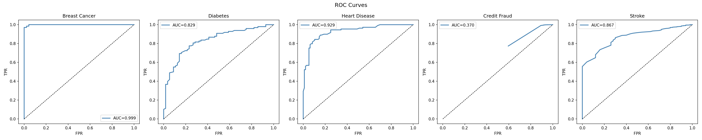
</p>

## Precision-Recall Curves — Where Imbalance Is Exposed

<p align="center">
  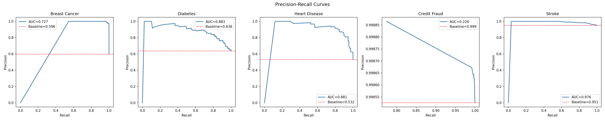
</p>

<p align="center"><i>PR curves expose what ROC hides on imbalanced data. Credit Fraud and Stroke collapse is visible here — invisible on accuracy alone.</i></p>

## Confusion Matrices — All 6 Datasets

<p align="center">
  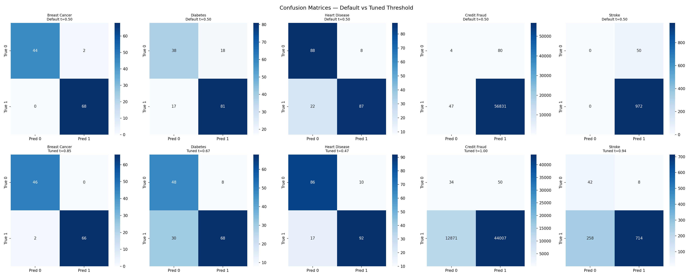
</p>

## The Honest Numbers

**Credit Fraud (0.17% minority class)**
```
Accuracy:  0.9978  ← Looks incredible. This is the lie.
MCC:       0.0600  ← Nearly useless. This is the truth.
ROC AUC:   0.370
PR AUC:    0.226   ← vs baseline of 0.999

Verdict: Model collapsed to majority class prediction.
         Threshold tuning made it worse.
         Fix requires SMOTE or class weighting — not threshold tricks.
```

**Stroke (4.87% minority class)**
```
Accuracy at default threshold:  0.9511
MCC at default threshold:       0.0000  ← Zero predictive power.

After threshold tuning (t=0.94):
MCC climbs to:                  0.2722

K-Fold CV: MCC 0.0000 ± 0.0000 across all 5 folds
Verdict: Threshold tuning rescues it partially. Class weighting needed.
```

**Adult Income (condition number: 4.14 × 10¹⁶)**
```
One-hot encoding creates near-perfect linear dependencies.
SGD loss at convergence:  0.9909  ← Complete failure
Mini-Batch GD:            Stable
Standard GD:              Stable but slow

Lesson: Condition number predicts optimizer failure before you run
        a single experiment. The math and empirics agree perfectly.
```

**Heart Disease — Two Data Points, One Decision Boundary**
```
High-leverage indices: 81 and 557
Training samples:      820 total

Removing either one improves MCC by 0.011.
Two data points. Measurable distortion.
High-leverage analysis is not academic — it is practically important.
```

---

## MCC vs Accuracy — Why The Metric Choice Matters

<p align="center">
  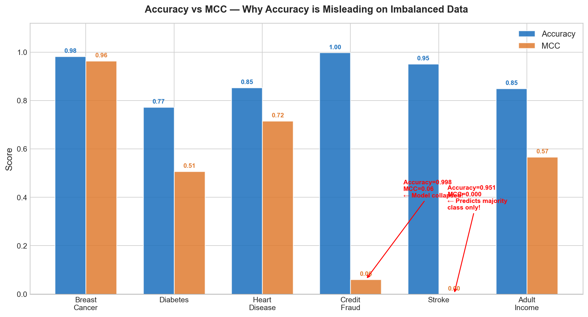
</p>

<p align="center"><i>High accuracy with near-zero MCC = your model learned nothing. Stroke and Credit Fraud live in that corner.</i></p>

---

## Final Results — All 6 Datasets

<p align="center">
  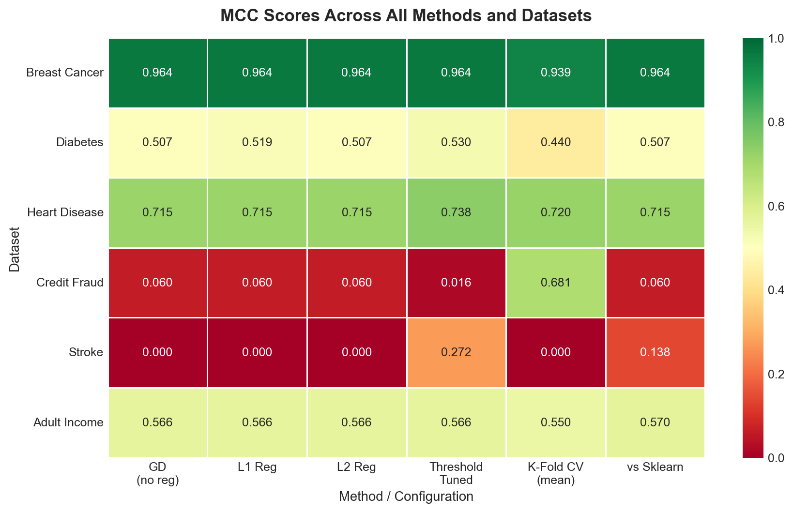
</p>

| Dataset | Accuracy | F1 | MCC | Honest Verdict |
|:---|:---:|:---:|:---:|:---|
| Breast Cancer | 0.9825 | 0.9855 | **0.9639** | Excellent |
| Heart Disease | 0.8537 | 0.8529 | **0.7153** | Strong |
| Adult Income | 0.8500 | 0.9043 | **0.5663** | Good |
| Diabetes | 0.7727 | 0.8223 | **0.5071** | Decent |
| Credit Fraud | 0.9978 | 0.9989 | **0.0600** | Collapsed → needs resampling |
| Stroke | 0.9511 | 0.9749 | **0.0000** | Collapsed → threshold tuning helps |

---

## Softmax — Multiclass Extension

<p align="center">
  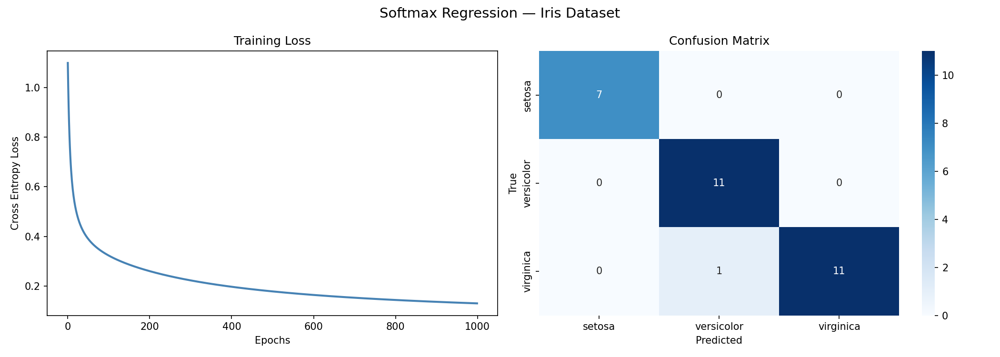
</p>

<p align="center"><i>SoftmaxRegression extending the binary engine to multiclass. Decision boundaries on Iris across 3 classes.</i></p>

```python
from logistic_master import SoftmaxRegression

model = SoftmaxRegression()
model.fit(X_train, y_train, alpha=0.1, epochs=1000)
y_pred = model.predict(X_test)   # argmax over K classes
```

---

## Benchmark — From Scratch vs Sklearn

<p align="center">
  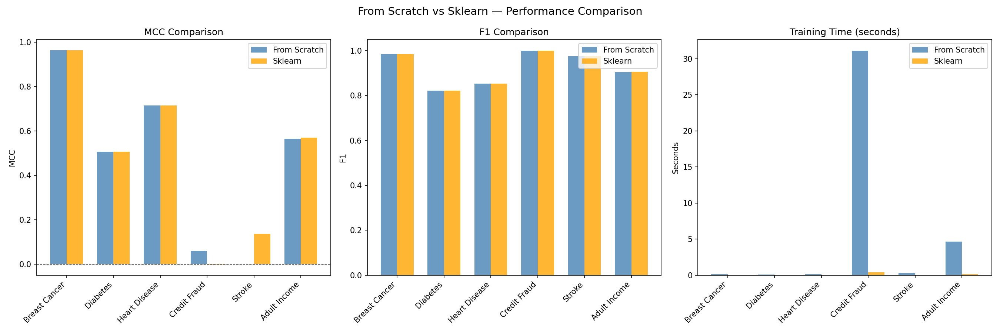
</p>

| Dataset | Scratch MCC | Sklearn MCC | Verdict |
|:---|:---:|:---:|:---:|
| Breast Cancer | 0.9639 | 0.9639 | ✅ **MATCH** |
| Diabetes | 0.5071 | 0.5071 | ✅ **MATCH** |
| Heart Disease | 0.7153 | 0.7153 | ✅ **MATCH** |
| Adult Income | 0.5663 | 0.5701 | ✅ **MATCH** |
| Credit Fraud | 0.0600 | -0.0009 | 🏆 **SCRATCH WINS** |
| Stroke | 0.0000 | 0.1380 | ❌ Sklearn wins (default L2 helps) |

**Why scratch beats sklearn on Credit Fraud:** Sklearn's default L2 regularization hurts precision on extreme class imbalance. When you understand the math, you can predict this outcome before running a single experiment.

**Speed gap:** Sklearn is 12×–82× faster. C++ vs Python NumPy. The point was never speed — it was understanding.

---

## Quick Start

```bash
git clone https://github.com/saicharan8855/logistic-regression-research-engine.git
cd logistic-regression-research-engine
pip install -r requirements.txt
jupyter notebook
```

**Recommended order:**
```
01 → 02 → 03 → 04 → 05 → 06 → 07 → 08 → 09 → 10
EDA  Pre  GD  Newton Reg  Diag  Inf  Fail  Adv  Bench
```

**Import pattern:**
```python
import sys, os
sys.path.append(os.path.join(os.getcwd(), '..', 'src'))

from preprocessing import *
from logistic_master import LogisticRegression, SoftmaxRegression
from utils import *
```

> ⚠️ **Credit Fraud dataset** — download from [Kaggle](https://www.kaggle.com/datasets/mlg-ulb/creditcardfraud) and place at `Data/raw/credit_fraud.csv`. Only needed for Notebooks 01–02. All 24 processed `.npy` arrays are already committed — notebooks 03 onwards run without it.

---

## Project Stats

| Metric | Value |
|:---|---:|
| Lines of code (`src/`) | ~400 |
| Git commits | 29 |
| Experiment notebooks | 10 |
| Theory derivations | 6 |
| Real-world datasets | 6 |
| Total training samples | ~325,000 |
| Figures generated | 22 |
| Phases completed | **10 / 10** |

---

## Roadmap

- [ ] SMOTE / class weighting for Credit Fraud and Stroke
- [ ] Multinomial logistic regression beyond 3 classes
- [ ] Stochastic Newton for large-scale datasets
- [ ] Bayesian logistic regression with MCMC sampling
- [ ] Interactive dashboard for live coefficient visualization
- [ ] Ordinal logistic regression extension

---

## License

MIT — see [LICENSE](LICENSE) for details.

---

<div align="center">


<br/>

*Built with NumPy. Validated against sklearn. Honest about every failure.*

**If this helped you understand logistic regression at a deeper level — a ⭐ goes a long way.**

</div>
